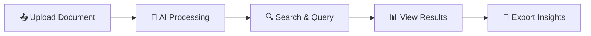
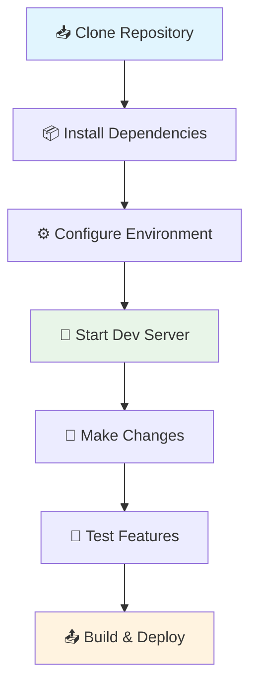

<div align="center">

# 🧠 DocMind
### Intelligent Document Processing Platform

<p align="center">
  <strong>Transform how you interact with documents through AI-powered semantic search, natural language queries, and intelligent analysis.</strong>
</p>

<p align="center">
  
  
  
  
</p>

<p align="center">
  <a href="#-quick-start">Quick Start</a> •
  <a href="#-features">Features</a> •
  <a href="#-demo">Demo</a> •
  <a href="#-documentation">Documentation</a> •
  <a href="#-contributing">Contributing</a>
</p>

---

</div>

## 🎯 What is DocMind?

DocMind revolutionizes document management by combining cutting-edge AI with intuitive design. Upload your documents and instantly unlock their potential through semantic search, natural language queries, and intelligent analysis.

### 🌟 Why Choose DocMind?

<table>
<tr>
<td width="50%">

**🚀 Lightning Fast**
- Instant document processing
- Real-time search results
- Optimized performance

**🧠 AI-Powered Intelligence**
- Semantic understanding
- Natural language queries
- Contextual insights

</td>
<td width="50%">

**🔒 Secure & Private**
- Local processing options
- Enterprise-grade security
- GDPR compliant

**📱 Modern Experience**
- Responsive design
- Dark mode support
- Accessibility focused

</td>
</tr>
</table>

---

## 📸 Screenshots

<div align="center">

### 🏠 Landing Page


### 📊 Dashboard Overview


### 🔍 Search Interface


### 📄 Document Management


</div>

## ✨ Features

<div align="center">

### 🎨 **Core Capabilities**

</div>

<table>
<tr>
<td width="50%" valign="top">

### 📄 **Smart Document Processing**

<details>
<summary><strong>🔧 Advanced Upload System</strong></summary>

- **Multi-format Support** 
  - PDF documents with OCR
  - Microsoft Word (DOCX)
  - Plain text files (TXT)
  - Rich text format (RTF)
  - More formats coming soon

- **Intelligent Processing**
  - Automatic text extraction
  - Metadata preservation
  - Content structure analysis
  - Error handling & validation

- **Real-time Features**
  - Live progress tracking
  - WebSocket status updates
  - Batch processing queue
  - Processing analytics

</details>

<details>
<summary><strong>🔍 Semantic Search Engine</strong></summary>

- **AI-Powered Search**
  - Vector embeddings for semantic understanding
  - Context-aware result ranking
  - Multi-language support
  - Fuzzy matching capabilities

- **Query Intelligence**
  - Natural language processing
  - Intent recognition
  - Query expansion
  - Auto-suggestions

- **Result Enhancement**
  - Highlighted excerpts
  - Relevance scoring
  - Source attribution
  - Export capabilities

</details>

</td>
<td width="50%" valign="top">

### 🤖 **AI-Powered Analysis**

<details>
<summary><strong>📊 Content Intelligence</strong></summary>

- **Document Analysis**
  - Automatic summarization
  - Key entity extraction
  - Topic modeling
  - Sentiment analysis

- **Classification System**
  - Content categorization
  - Tag generation
  - Priority scoring
  - Duplicate detection

- **Insights Generation**
  - Trend identification
  - Pattern recognition
  - Relationship mapping
  - Anomaly detection

</details>

<details>
<summary><strong>📈 Analytics Dashboard</strong></summary>

- **Usage Metrics**
  - Document processing stats
  - Query performance analytics
  - User activity tracking
  - System health monitoring

- **Content Analytics**
  - Document collection insights
  - Search pattern analysis
  - Popular content identification
  - Usage trend visualization

- **Performance Monitoring**
  - Response time tracking
  - Error rate monitoring
  - Resource utilization
  - Optimization recommendations

</details>

</td>
</tr>
</table>

---

## 🎮 Demo

<div align="center">

### 🚀 **Try DocMind Live**

<p>
  <a href="#" style="text-decoration: none;">
    
  </a>
  <a href="#" style="text-decoration: none;">
    
  </a>
  <a href="#" style="text-decoration: none;">
    
  </a>
</p>

### 🎯 **Quick Demo Steps**



</div>

## 🚀 Quick Start

<div align="center">

### ⚡ **Get DocMind Running in 3 Minutes**

</div>

<table>
<tr>
<td width="50%" valign="top">

### 📋 **Prerequisites**

<details>
<summary><strong>🔧 System Requirements</strong></summary>

**Required:**
- **Node.js** 18.0+ ([Download](https://nodejs.org/))
- **npm** 9.0+ (comes with Node.js)
- **Git** ([Download](https://git-scm.com/))

**Recommended:**
- **VS Code** with extensions:
  - TypeScript and JavaScript Language Features
  - Tailwind CSS IntelliSense
  - ES7+ React/Redux/React-Native snippets

**Browser Support:**
- Chrome 90+
- Firefox 88+
- Safari 14+
- Edge 90+

</details>

<details>
<summary><strong>🔑 API Keys (Optional)</strong></summary>

For full AI functionality:
- **OpenAI API Key** ([Get one here](https://platform.openai.com/api-keys))
- **Anthropic API Key** (Alternative AI provider)
- **Custom AI Endpoint** (For self-hosted models)

</details>

</td>
<td width="50%" valign="top">

### 🎯 **Installation Steps**

<details>
<summary><strong>📥 Step 1: Clone & Setup</strong></summary>

```bash
# Clone the repository
git clone https://github.com/your-username/docmind.git
cd docmind

# Install dependencies
npm install

# Copy environment template
cp .env.example .env
```

</details>

<details>
<summary><strong>⚙️ Step 2: Configuration</strong></summary>

Edit `.env` file:
```bash
# Basic Configuration
NEXT_PUBLIC_API_URL=http://localhost:3000
NODE_ENV=development

# AI Configuration (Optional)
OPENAI_API_KEY=your_openai_key_here
ANTHROPIC_API_KEY=your_anthropic_key_here

# Upload Settings
MAX_FILE_SIZE=10485760  # 10MB
UPLOAD_DIR=./public/uploads
```

</details>

<details>
<summary><strong>🚀 Step 3: Launch</strong></summary>

```bash
# Start development server
npm run dev

# Or with custom port
npm run dev -- --port 3001
```

**🎉 Open [http://localhost:3000](http://localhost:3000)**

</details>

</td>
</tr>
</table>

---

### 🔄 **Development Workflow**

<div align="center">



</div>

### 🏗️ **Production Deployment**

<details>
<summary><strong>🌐 Vercel (Recommended)</strong></summary>

```bash
# Install Vercel CLI
npm i -g vercel

# Deploy to Vercel
vercel

# Set environment variables in Vercel dashboard
```

[](https://vercel.com/new/clone?repository-url=https://github.com/your-username/docmind)

</details>

<details>
<summary><strong>🐳 Docker Deployment</strong></summary>

```bash
# Build Docker image
docker build -t docmind .

# Run container
docker run -p 3000:3000 -e OPENAI_API_KEY=your_key docmind
```

</details>

<details>
<summary><strong>🖥️ Manual Deployment</strong></summary>

```bash
# Build for production
npm run build

# Start production server
npm start

# Or use PM2 for process management
npm install -g pm2
pm2 start npm --name "docmind" -- start
```

</details>

## 🏗️ Technology Stack

<div align="center">

### 🛠️ **Built with Modern Technologies**

</div>

<table>
<tr>
<td width="50%" valign="top">

### 🎨 **Frontend Technologies**

<details>
<summary><strong>⚡ Core Framework</strong></summary>

- **Next.js 15** 
  - App Router architecture
  - Server-side rendering (SSR)
  - Static site generation (SSG)
  - API routes integration

- **TypeScript 5.0** 
  - Type-safe development
  - Enhanced IDE support
  - Better code maintainability
  - Compile-time error checking

</details>

<details>
<summary><strong>🎨 Styling & UI</strong></summary>

- **Tailwind CSS 4** 
  - Utility-first CSS framework
  - Custom design system
  - Responsive design utilities
  - Dark mode support

- **shadcn/ui** 
  - High-quality components
  - Accessible by default
  - Customizable themes
  - TypeScript support

- **Framer Motion** 
  - Smooth animations
  - Gesture support
  - Layout animations
  - Performance optimized

</details>

<details>
<summary><strong>📱 User Experience</strong></summary>

- **Lucide React** - 1000+ beautiful icons
- **Responsive Design** - Mobile-first approach
- **Dark Mode** - System preference detection
- **Accessibility** - WCAG 2.1 AA compliant
- **Progressive Web App** - Offline capabilities

</details>

</td>
<td width="50%" valign="top">

### 🔧 **Backend & Processing**

<details>
<summary><strong>🌐 Data Management</strong></summary>

- **TanStack Query** 
  - Intelligent caching
  - Background updates
  - Optimistic updates
  - Error handling

- **Axios** 
  - HTTP client library
  - Request/response interceptors
  - Automatic JSON parsing
  - Error handling

- **Socket.io** 
  - Real-time communication
  - WebSocket fallback
  - Room management
  - Event-driven architecture

</details>

<details>
<summary><strong>📄 Document Processing</strong></summary>

- **PDF Processing**
  - PDF-Parse for text extraction
  - PDF.js for rendering
  - OCR capabilities
  - Metadata extraction

- **Office Documents**
  - Mammoth for DOCX processing
  - RTF support
  - Formatting preservation
  - Table extraction

- **Text Processing**
  - Natural language processing
  - Encoding detection
  - Content sanitization
  - Structure analysis

</details>

<details>
<summary><strong>🤖 AI Integration</strong></summary>

- **OpenAI GPT Models** - Text analysis and generation
- **Anthropic Claude** - Alternative AI provider
- **Vector Embeddings** - Semantic search capabilities
- **Custom Models** - Self-hosted AI support

</details>

</td>
</tr>
</table>

---

### 🔧 **Development Tools**

<div align="center">

| Category | Tools | Purpose |
|----------|--------|---------|
| **📝 Code Quality** | ESLint, Prettier, Husky | Linting, formatting, git hooks |
| **🧪 Testing** | Jest, React Testing Library | Unit and integration testing |
| **📦 Build Tools** | Webpack, SWC, Turbopack | Fast builds and bundling |
| **🔍 Type Checking** | TypeScript, tsc | Static type analysis |
| **📊 Analytics** | Vercel Analytics, Web Vitals | Performance monitoring |

</div>

## 📁 Project Structure

<div align="center">

### 🗂️ **Well-Organized Codebase**

</div>

<details>
<summary><strong>📂 Complete Directory Structure</strong></summary>

```
docmind/
├── 📁 src/                           # Source code
│   ├── 📁 app/                       # Next.js App Router
│   │   ├── 📁 api/                   # API endpoints
│   │   │   ├── 📁 analysis/          # Document analysis
│   │   │   ├── 📁 documents/         # Document management
│   │   │   ├── 📁 query/             # Search queries
│   │   │   ├── 📁 search/            # Search functionality
│   │   │   └── 📁 settings/          # Configuration
│   │   ├── 📁 auth/                  # Authentication
│   │   ├── 📁 dashboard/             # Main dashboard
│   │   ├── 📁 preview/               # Document preview
│   │   ├── 📁 settings/              # Settings page
│   │   ├── 🎨 globals.css            # Global styles
│   │   ├── 📄 layout.tsx             # Root layout
│   │   └── 🏠 page.tsx               # Landing page
│   ├── 📁 components/                # React components
│   │   ├── 📁 ui/                    # shadcn/ui components
│   │   │   ├── 🔘 button.tsx         # Button component
│   │   │   ├── 📋 card.tsx           # Card component
│   │   │   ├── 📝 input.tsx          # Input component
│   │   │   └── ... (30+ components)
│   │   ├── 📁 auth/                  # Authentication
│   │   │   ├── 🔐 login-modal.tsx    # Login modal
│   │   │   └── 📝 signup-modal.tsx   # Signup modal
│   │   ├── 📁 settings/              # Settings components
│   │   ├── 📤 document-upload.tsx    # Upload interface
│   │   ├── 🔍 query-interface.tsx    # Search interface
│   │   ├── 📄 document-list.tsx      # Document listing
│   │   ├── 📊 analysis-results.tsx   # Results display
│   │   ├── 🏠 landing-page.tsx       # Landing page
│   │   └── 🔒 protected-route.tsx    # Route protection
│   ├── 📁 hooks/                     # Custom React hooks
│   │   ├── 🔌 use-socket.ts          # WebSocket hook
│   │   ├── 📱 use-mobile.ts          # Mobile detection
│   │   └── 🍞 use-toast.ts           # Toast notifications
│   └── 📁 lib/                       # Utilities & config
│       ├── 🤖 ai-service.ts          # AI integration
│       ├── 🌐 api-client.ts          # API client
│       ├── 🔐 auth-context.tsx       # Auth context
│       ├── 🔌 socket-types.ts        # Socket types
│       ├── 🗄️ supabase.ts           # Database client
│       └── 🛠️ utils.ts               # Helper functions
├── 📁 public/                        # Static assets
│   ├── 📁 uploads/                   # Document storage
│   │   └── 📁 documents/             # Organized by ID
│   ├── 🖼️ favicon.ico               # Favicon
│   ├── 🎨 logo.svg                   # App logo
│   └── 🤖 robots.txt                # SEO robots
├── 📁 docs/                          # Documentation
│   ├── 📖 API.md                     # API documentation
│   ├── 🎨 DESIGN.md                  # Design system
│   └── 🚀 DEPLOYMENT.md              # Deployment guide
├── ⚙️ next.config.ts                 # Next.js config
├── 🎨 tailwind.config.ts             # Tailwind config
├── 📦 package.json                   # Dependencies
└── 📝 README.md                      # This file
```

</details>

### 🧩 **Key Components Overview**

<table>
<tr>
<td width="50%" valign="top">

#### 🎨 **UI Components**

<details>
<summary><strong>📤 Document Upload</strong></summary>

- **Features:**
  - Drag & drop interface
  - Progress tracking
  - File validation
  - Batch processing
  - Error handling

- **Files:**
  - `document-upload.tsx`
  - `use-upload.ts` (hook)
  - Upload API routes

</details>

<details>
<summary><strong>🔍 Query Interface</strong></summary>

- **Features:**
  - Natural language input
  - Query suggestions
  - Real-time search
  - Result filtering
  - History tracking

- **Files:**
  - `query-interface.tsx`
  - `use-search.ts` (hook)
  - Search API routes

</details>

</td>
<td width="50%" valign="top">

#### 🔧 **Core Systems**

<details>
<summary><strong>🤖 AI Integration</strong></summary>

- **Features:**
  - Multiple AI providers
  - Semantic embeddings
  - Content analysis
  - Response streaming
  - Error handling

- **Files:**
  - `ai-service.ts`
  - `ai-api-settings.tsx`
  - Analysis API routes

</details>

<details>
<summary><strong>🔐 Authentication</strong></summary>

- **Features:**
  - Secure login/signup
  - Session management
  - Protected routes
  - User context
  - OAuth support

- **Files:**
  - `auth-context.tsx`
  - `protected-route.tsx`
  - Auth modals

</details>

</td>
</tr>
</table>

## 🎯 Usage Guide

<div align="center">

### 📚 **How to Use DocMind**

</div>

<table>
<tr>
<td width="50%" valign="top">

### 📤 **Document Upload**

<details>
<summary><strong>🚀 Getting Started</strong></summary>

**Step 1: Access Upload**
- Navigate to Dashboard
- Click "Upload Documents" tab
- Or use drag & drop anywhere

**Step 2: Select Files**
```bash
Supported formats:
✅ PDF documents
✅ Microsoft Word (.docx)
✅ Plain text (.txt)
✅ Rich text (.rtf)
```

**Step 3: Monitor Progress**
- Real-time processing status
- Error notifications
- Completion confirmations

</details>

### 🔍 **Search & Query**

<details>
<summary><strong>💡 Search Tips</strong></summary>

**Natural Language Queries:**
- "What are the main findings about climate change?"
- "Show me documents about machine learning"
- "Find contracts signed in 2023"

**Advanced Features:**
- Filter by date range
- Sort by relevance
- Export results
- Save searches

</details>

</td>
<td width="50%" valign="top">

### 📊 **Analysis Features**

<details>
<summary><strong>🤖 AI Analysis</strong></summary>

**Automatic Analysis:**
- Document summarization
- Key entity extraction
- Topic classification
- Sentiment analysis

**Custom Queries:**
- Ask specific questions
- Generate reports
- Compare documents
- Extract insights

</details>

### ⚙️ **Settings & Configuration**

<details>
<summary><strong>🔧 Customization</strong></summary>

**AI Configuration:**
- Choose AI provider
- Set API keys
- Adjust parameters
- Monitor usage

**Processing Settings:**
- File size limits
- Batch processing
- Quality settings
- Performance tuning

</details>

</td>
</tr>
</table>

---

## 📊 Performance & Metrics

<div align="center">

### ⚡ **Built for Speed**

| Metric | Performance | Details |
|--------|-------------|---------|
| **🚀 Page Load** | < 2s | Optimized bundles & caching |
| **📄 Document Processing** | < 30s | Parallel processing pipeline |
| **🔍 Search Response** | < 500ms | Vector search optimization |
| **📱 Mobile Performance** | 95+ | Lighthouse performance score |
| **♿ Accessibility** | AA | WCAG 2.1 compliance |

</div>

## 🔧 Configuration

<div align="center">

### ⚙️ **Environment Setup**

</div>

<details>
<summary><strong>🌍 Environment Variables</strong></summary>

```bash
# ===== CORE CONFIGURATION =====
NEXT_PUBLIC_API_URL=http://localhost:3000
NODE_ENV=development
PORT=3000

# ===== AI PROVIDERS =====
# OpenAI Configuration
OPENAI_API_KEY=your_real_openai_api_key_here
OPENAI_MODEL=gpt-4-turbo-preview
OPENAI_MAX_TOKENS=4096

# Anthropic Configuration (Alternative)
ANTHROPIC_API_KEY=your_anthropic_key_here
ANTHROPIC_MODEL=claude-3-sonnet-20240229

# ===== DATABASE =====
# Supabase Configuration
NEXT_PUBLIC_SUPABASE_URL=your_supabase_url
NEXT_PUBLIC_SUPABASE_ANON_KEY=your_supabase_anon_key
SUPABASE_SERVICE_ROLE_KEY=your_service_role_key

# ===== UPLOAD SETTINGS =====
MAX_FILE_SIZE=10485760          # 10MB
MAX_FILES_PER_BATCH=10
ALLOWED_FILE_TYPES=pdf,docx,txt,rtf
UPLOAD_DIR=./public/uploads

# ===== PROCESSING =====
BATCH_SIZE=5
PROCESSING_TIMEOUT=30000        # 30 seconds
VECTOR_DIMENSIONS=1536
CHUNK_SIZE=1000
CHUNK_OVERLAP=200

# ===== SECURITY =====
JWT_SECRET=your_jwt_secret_here
ENCRYPTION_KEY=your_encryption_key
RATE_LIMIT_MAX=100              # requests per window
RATE_LIMIT_WINDOW=900000        # 15 minutes
```

</details>

<details>
<summary><strong>🤖 AI Provider Configuration</strong></summary>

**OpenAI Setup:**
```typescript
// In settings panel or environment
{
  provider: "openai",
  apiKey: "your_real_api_key_here",
  model: "gpt-4-turbo-preview",
  maxTokens: 4096,
  temperature: 0.7
}
```

**Anthropic Setup:**
```typescript
{
  provider: "anthropic", 
  apiKey: "your_real_anthropic_api_key_here",
  model: "claude-3-sonnet-20240229",
  maxTokens: 4096
}
```

**Custom Endpoint:**
```typescript
{
  provider: "custom",
  endpoint: "https://your-ai-api.com/v1/chat",
  headers: { "Authorization": "Bearer your-token" }
}
```

</details>

---

## 🔒 Security & Privacy

<div align="center">

### 🛡️ **Enterprise-Grade Security**

</div>

<table>
<tr>
<td width="50%" valign="top">

### 🔐 **Data Protection**

<details>
<summary><strong>🔒 Encryption & Storage</strong></summary>

- **End-to-End Encryption**
  - AES-256 encryption for files
  - Encrypted database storage
  - Secure API communication

- **Data Isolation**
  - User-specific data separation
  - Role-based access control
  - Secure file handling

- **Privacy Compliance**
  - GDPR compliant
  - No data tracking
  - User data ownership

</details>

### 🛡️ **Authentication**

<details>
<summary><strong>🔑 Secure Access</strong></summary>

- **Multi-Factor Authentication**
- **OAuth Integration** (Google, GitHub)
- **JWT Token Management**
- **Session Security**
- **Password Policies**

</details>

</td>
<td width="50%" valign="top">

### 🚨 **Security Features**

<details>
<summary><strong>⚡ Protection Measures</strong></summary>

- **File Validation**
  - Strict type checking
  - Size limitations
  - Malware scanning
  - Content sanitization

- **API Security**
  - Rate limiting
  - Request validation
  - CORS protection
  - Input sanitization

- **Infrastructure**
  - HTTPS enforcement
  - Security headers
  - CSP policies
  - Regular updates

</details>

### 📊 **Monitoring**

<details>
<summary><strong>🔍 Security Monitoring</strong></summary>

- **Access Logging**
- **Error Tracking**
- **Performance Monitoring**
- **Security Alerts**
- **Audit Trails**

</details>

</td>
</tr>
</table>

---

## 📚 API Documentation

<div align="center">

### 🌐 **RESTful API Endpoints**

</div>

<details>
<summary><strong>📄 Document Management</strong></summary>

```typescript
// Upload document
POST /api/documents/upload
Content-Type: multipart/form-data
Body: { file: File, metadata?: object }

// Get documents
GET /api/documents
Query: { page?, limit?, search?, filter? }

// Get document by ID
GET /api/documents/[id]
Response: { id, title, content, metadata, status }

// Delete document
DELETE /api/documents/[id]
```

</details>

<details>
<summary><strong>🔍 Search & Query</strong></summary>

```typescript
// Semantic search
POST /api/search
Body: { 
  query: string,
  filters?: object,
  limit?: number 
}

// Natural language query
POST /api/query
Body: {
  question: string,
  documentIds?: string[],
  context?: string
}

// Get search history
GET /api/search/history
```

</details>

<details>
<summary><strong>🤖 AI Analysis</strong></summary>

```typescript
// Analyze document
POST /api/analysis
Body: {
  documentId: string,
  analysisType: 'summary' | 'entities' | 'sentiment'
}

// Batch analysis
POST /api/analysis/batch
Body: {
  documentIds: string[],
  analysisTypes: string[]
}
```

</details>

## 🤝 Contributing

<div align="center">

### 🌟 **Join Our Community**

</div>

<table>
<tr>
<td width="50%" valign="top">

### 🚀 **Getting Started**

<details>
<summary><strong>🔧 Development Setup</strong></summary>

1. **Fork & Clone**
   ```bash
   git clone https://github.com/your-username/docmind.git
   cd docmind
   ```

2. **Install Dependencies**
   ```bash
   npm install
   ```

3. **Create Feature Branch**
   ```bash
   git checkout -b feature/amazing-feature
   ```

4. **Make Changes**
   - Follow coding standards
   - Add tests for new features
   - Update documentation

5. **Submit Pull Request**
   - Clear description
   - Link related issues
   - Request review

</details>

### 📋 **Contribution Guidelines**

<details>
<summary><strong>✅ Code Standards</strong></summary>

- **TypeScript** - Strict type checking
- **ESLint** - Code linting rules
- **Prettier** - Code formatting
- **Conventional Commits** - Commit message format
- **Testing** - Unit tests for new features

</details>

</td>
<td width="50%" valign="top">

### 🎯 **Ways to Contribute**

<details>
<summary><strong>🔨 Development</strong></summary>

- **🐛 Bug Fixes** - Fix reported issues
- **✨ New Features** - Add functionality
- **🎨 UI/UX** - Improve user experience
- **📚 Documentation** - Enhance docs
- **🧪 Testing** - Add test coverage

</details>

### 🏆 **Recognition**

<details>
<summary><strong>👥 Contributors</strong></summary>

All contributors are recognized in:
- GitHub contributors page
- Project documentation
- Release notes
- Community showcase

**Top Contributors:**
- 🥇 Most commits
- 🥈 Best documentation
- 🥉 Most helpful reviews

</details>

</td>
</tr>
</table>

---

## 🆘 Support & Community

<div align="center">

### 💬 **Get Help & Connect**

<p>
  <a href="#" style="text-decoration: none;">
    
  </a>
  <a href="#" style="text-decoration: none;">
    
  </a>
  <a href="#" style="text-decoration: none;">
    
  </a>
</p>

</div>

<table>
<tr>
<td width="33%" valign="top" align="center">

### 📚 **Documentation**

- **📖 [User Guide](docs/USER_GUIDE.md)**
- **🔧 [API Reference](docs/API.md)**
- **🎨 [Design System](docs/DESIGN.md)**
- **🚀 [Deployment](docs/DEPLOYMENT.md)**

</td>
<td width="33%" valign="top" align="center">

### 🐛 **Issues & Bugs**

- **🔍 [Search Issues](https://github.com/your-username/docmind/issues)**
- **📝 [Report Bug](https://github.com/your-username/docmind/issues/new?template=bug_report.md)**
- **💡 [Feature Request](https://github.com/your-username/docmind/issues/new?template=feature_request.md)**
- **❓ [Ask Question](https://github.com/your-username/docmind/discussions)**

</td>
<td width="33%" valign="top" align="center">

### 🌐 **Community**

- **💬 [Discord Server](https://discord.gg/docmind)**
- **🐦 [Twitter Updates](https://twitter.com/docmind)**
- **📧 [Newsletter](https://docmind.dev/newsletter)**
- **📱 [LinkedIn](https://linkedin.com/company/docmind)**

</td>
</tr>
</table>

---

## 📊 Project Stats

<div align="center">


</div>

---

## 📄 License

<div align="center">

**MIT License** - See [LICENSE](LICENSE) file for details

*This project is open source and available under the MIT License.*

</div>

---

<div align="center">

## 🎉 **Thank You!**

### **DocMind** - Making documents intelligent, searchable, and actionable

*Built with ❤️ by the DocMind team and amazing contributors*

<p>
  <strong>⭐ Star this repo if you find it helpful!</strong><br>
  <em>Your support helps us continue improving DocMind</em>
</p>

---

<sub>🚀 **Ready to transform your documents?** [Get started now](#-quick-start) | 📚 **Need help?** [Join our community](#-support--community)</sub>

</div>
